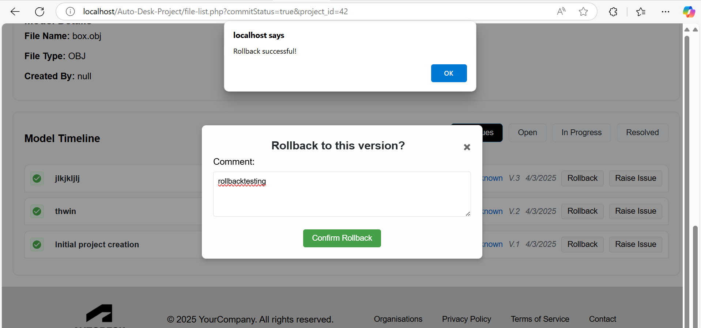
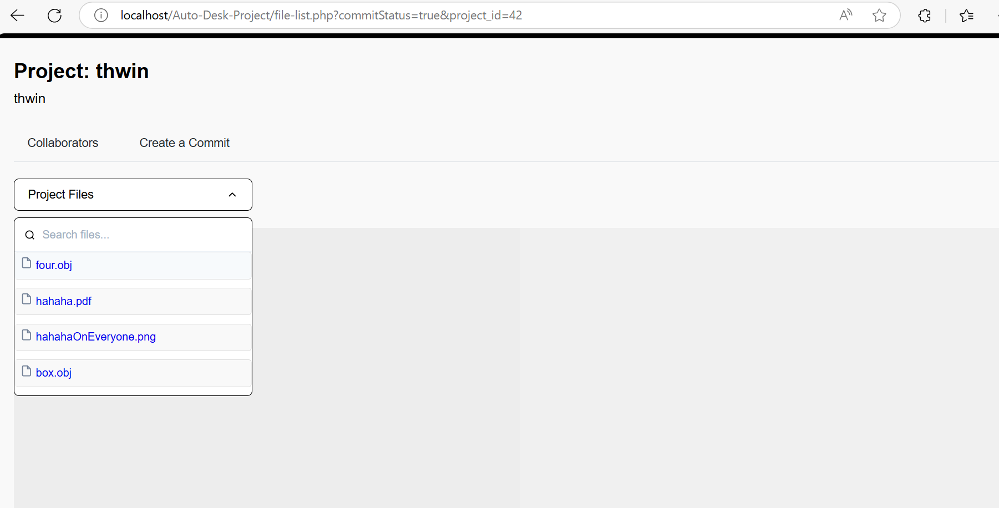

# Week 10(Spring Week)
## What I Did During This Session
### 1. Merging Code with Main Branch

At the start of Spring Week, I focused on merging my code into the main branch. However, I ran into conflicts due to my code being uploaded only to the project-file database, which clashed with Aryan's commit logic. To resolve this, I first took time to understand his approach, then adjusted my own logic accordingly. This took longer than expected but was crucial for ensuring smooth integration. Additionally, I worked with Aryan to merge our code, which allowed us to successfully display the thumbnail feature as intended. This collaborative effort ensured that both functionalities were properly integrated into the project.

### 2. Switching from SQLite to MySQL
Initially, I had written the database connection with MySQL, but Aryan suggested using SQLite, believing it would be a better option for creating tables. As a result, we switched all our tables to SQLite. However, this decision led to inconsistencies and issues on other team members' machines, which caused further delays. To resolve this, we eventually switched back to MySQL to ensure compatibility across all team members' environments, stabilizing the project once again.

### 3. Handling Object Keys and Translation Issues
One of the challenges I faced was with the object key format for version control, particularly when dealing with file uploads for the translation part of the project. Aryan's approach used an object key format that combined the project ID, file name, and version number. However, I needed to use a different format that simply used the full file name.

This difference in formatting caused issues when decoding the object key, especially when the object key included numbers. I tested the encoded object key using Postman and discovered that the decoding process failed due to the format change, particularly with numeric values. After further testing with Autodesk's API, I confirmed that while files were being uploaded to the bucket correctly, the URN could not be found, which led to translation failures. I used a base64 decoding tool to identify that the URN's format had changed, which was causing the issue. Based on this discovery, I adjusted the encoding process to maintain the URN format, which resolved the issue.

### 4. Uploading All Documents and Version Control
Once I resolved the object key and translation issues, I moved forward with uploading the project files (including documents, images, and other assets) to the bucket. After uploading, I was able to retrieve the version number and download the files back into local storage for display purposes. I also worked on integrating the commit button with the upload logic to ensure the upload and commit processes were synchronized.

### 5. Rollback Functionality
Another feature I worked on was the rollback functionality. This feature would allow users to click a rollback button, which would delete entries from the database. However, I encountered an error when implementing this feature, as I received a syntax error: VM2601:1 Uncaught (in promise) SyntaxError: Unexpected token '< br >', "... is not valid JSON. I worked through this issue and fixed it, enabling the rollback feature to work as expected.

### 6. Continuation of Object Key & URN Issue: Displaying PDFs, DOCX, and Media Files
After fixing the rollback issue, I shifted my focus to fixing errors related to displaying PDF, DOCX, images, and videos. I discovered that while files were uploaded successfully to the bucket, the download process was failing due to empty URNs. After using Postman to verify the upload process, I found that the URNs were missing when attempting to download the files. I decoded the URN to confirm its format and identified that it was being altered during the upload process. After correcting the URN format, I was able to display PDF, DOCX, and other file types correctly.

### 7. Email Invitation Feature Implementation
After the demo day, I continued working on the feature for sending email invitations to members, as requested by Nadia. She wanted the organization admin or owner to be able to invite a member by sending an email containing their email and password. I successfully implemented this functionality, ensuring that when the user clicks the "Add Member" button, an email invitation is sent to the specified member's email address with their login credentials. To make this feature work properly, I modified the php.ini file to configure the SMTP settings and downloaded and configured the PHPMailer library to avoid any errors related to email sending.

https://www.youtube.com/watch?v=4TmD4ly7V_E
https://www.youtube.com/watch?v=UDPIJkkWqQU

The screenshot below demonstrates the functionality of sending a custom password to the user's email address after account creation.

The screenshot below demonstrates the functionality of sending a random password to the user's email address after account creation.

### 8. Issues Feature Implementation
After successfully implementing the email invitation feature, I moved on to working on the issues part of the project. The goal is to allow users to raise issues related to file versions, where they can submit files and descriptions that get inserted into the issues table. For now, I’ve set up the functionality to capture the issue details (files and descriptions) and insert them into the issues table in the database. This allows users to raise issues associated with specific file versions and commits, which helps track and manage these issues effectively. The feature is still a work in progress, as I’m refining the logic to ensure that issues are raised properly and linked to the respective file versions and commits. I will continue working on this part to ensure that it functions smoothly.

## Any Issues Arising and How I Intend to Resolve Them:

### 1. Merging Code with Main Branch
Issue: When merging the code, I realized I needed more time to fully grasp Aryan's approach. This delay was due to my lack of understanding of his commit logic, which caused the merging process to take longer than anticipated. It highlighted a weakness in our group's workflow, as we tried to merge our changes on the first day but ended up taking the second day to resolve the conflicts.

Resolution: To avoid this issue in the future, I intend to spend more time understanding the logic of others' code before attempting a merge. In our group, a better approach would be to prioritize early communication and sync up our code changes well in advance. This will help reduce merge conflicts and allow for a smoother integration process in the future.

### 2. Switching from SQLite to MySQL
Issue: The main issue arose when SQLite was not functioning properly on other team members' setups, causing compatibility problems. This inconsistency slowed down the project, as it was difficult for the whole team to work with the same database system without facing issues.

Resolution: To resolve this, I decided to switch back to MySQL, which I had initially used and found to be more stable. Going forward, I believe we need to make more informed decisions regarding the choice of technologies and ensure that such decisions are tested thoroughly before being implemented across the team. This way, we can avoid unnecessary delays and disruptions in the future.

### 3. Handling Object Keys and Translation Issues
Issue: While working on this, I encountered discrepancies between the expected object key format. Aryan’s version was tailored to his logic, while I needed to use a simpler format for my tasks. To further investigate the issue, I had to check all the objects in the bucket and use Postman to understand why the files were not being decoded correctly. This troubleshooting process, while essential, took more time than I initially anticipated.

>>>>>>>>>>>>>>>>>>>>>>>>>>>>>>>>>>>>>>>>>>>>>>>>>>>>>>>>>>>>>>>>>>>>>>>>>>>>>>>>>>>>>>>>>>>>>>>>
Starting translation for URN: dXJuOmFkc2sub2JqZWN0czpvcy5vYmplY3Q6bXlidWNrZXRfMjAyNS82X2JveF9WMg main.js:231 Raw server response: main.js:235 Empty response received startTranslation @ main.js:235 await in startTranslation (anonymous) @ main.js:37 main.js:46 Translation failed to start.
>>>>>>>>>>>>>>>>>>>>>>>>>>>>>>>>>>>>>>>>>>>>>>>>>>>>>>>>>>>>>>>>>>>>>>>>>>>>>>>>>>>>>>>>>>>>>>>>

Resolution: After a lot of trial and error, I found a solution to resolve the object key issue. However, the delay was unexpected, and I realized that the lack of communication and discussion about the exact data needed for the task led to this problem. We had different requirements for the object key format—while I needed the full file name, Aryan needed the format that included the project ID and version number. Moving forward, I believe it’s crucial for us to have more in-depth discussions and align our tasks and data requirements before implementing solutions. This would prevent delays and ensure smoother progress on group projects.

### 4.Uploading Documents, Version Control, and Object Key & URN Issues
Issue: Although the upload process was functioning correctly, I encountered an issue when the files were successfully uploaded to the Autodesk bucket, but when I tried to download them, the URN was empty. Upon investigation, I found that the root cause was related to the object key format. The file names stored during the upload process did not match the expected format when retrieving the files, leading to failed downloads. Essentially, the issue was the same, as it affected both the downloading and displaying of files. This occurred because, after uploading, I attempted to download the corresponding version and display it, but the URNs were not properly generated due to the object key format inconsistencies.

Error: Failed to call start_downloading.php: TypeError: Failed to fetch at tempDownloadFile (main.js:234:32) at HTMLAnchorElement. (main.js:57:23) tempDownloadFile @ main.js:245 await in tempDownloadFile (anonymous) @ main.js:57 pdf.min.js:22 Deprecated API usage: No "GlobalWorkerOptions.workerSrc" specified. main.js:155 Download link displayed: http://localhost/Auto-Desk-Project/backend/Business_Logic/Function/download.php?file=hahaha.pdf pdf.worker.min.js:22 Warning: Indexing all PDF objects main.js:152 Error loading PDF: InvalidPDFException: Invalid PDF structure. (anonymous) @ main.js:152 Promise.catch (anonymous) @ main.js:151 main.js:245 Failed to call start_downloading.php: TypeError: Failed to fetch at tempDownloadFile (main.js:234:32) at HTMLAnchorElement. (main.js:57:23) tempDownloadFile @ main.js:245 await in tempDownloadFile (anonymous) @ main.js:57 main.js:187 Download link displayed: http://localhost/Auto-Desk-Project/backend/Business_Logic/Function/download.php?file=hahahaOnYou.docx main.js:166 Word document loaded main.js:184 Error loading .docx file: Error: Can't find end of central directory : is this a zip file ? If it is, see http://stuk.github.io/jszip/documentation/howto/read_zip.html at ZipEntries.readEndOfCentral (mammoth.browser.min.js:11:5071) at ZipEntries.load (mammoth.browser.min.js:11:6515) at new ZipEntries (mammoth.browser.min.js:11:2154) at module.exports [as load] (mammoth.browser.min.js:10:10583) at new JSZip (mammoth.browser.min.js:10:9606) at Object.openArrayBuffer (mammoth.browser.min.js:3:12291) at Object.openZip (mammoth.browser.min.js:1:1180) at convert (mammoth.browser.min.js:2:13894) at Object.convertToHtml (mammoth.browser.min.js:2:13630) at main.js:169:21 (anonymous) @ main.js:184 Promise.catch (anonymous) @ main.js:183

Resolution: To resolve the issue, I decoded and validated the URN format and ensured that it matched the expected structure. I also reviewed the object key logic and corrected the formatting to ensure it was consistent across upload and download operations. Once the object key and URN formats were properly aligned, the files—including PDFs, DOCX, and other media types—were displayed successfully without any errors.

### 5. Rollback Functionality
Issue: While implementing the rollback functionality in the project, I encountered a critical issue where an error occurred when attempting to delete entries from the database. Specifically, when the rollback feature was triggered, an error message was displayed: "VM2601:1 Uncaught (in promise) SyntaxError: Unexpected token '< br >', "
"... is not valid JSON." This error indicated that the system was expecting a JSON response, but instead, it was receiving an HTML response, likely an error page from the server. Upon investigation, I realized that the issue was not with the API itself but with my code. The problem arose because the response had an extra space in the query, which led to the unexpected behavior.

Resolution: To resolve this, I began by debugging the issue through a careful examination of the request-response cycle. I checked how the rollback function was interacting with the database and identified that the error originated from the server’s failure to send a JSON response. Instead, the server was returning an HTML error message. After pinpointing this, I updated my code to ensure that the server returned a properly formatted JSON response. Once this change was made, the rollback functionality worked as intended, with no further errors. The server now explicitly sets the response type to JSON, preventing the issue from reoccurring.

.png)

### 6.Email Invitation Feature Implementation
Issue: While implementing the email invitation feature, I initially encountered an error when trying to send emails using the default PHP mail() function without proper SMTP configuration. The error message I received was:

Warning: mail(): SMTP server response: 530-5.7.0 Must issue a STARTTLS command first. For more information, go to 530-5.7.0 https://support.google.com/a/answer/3221692 and review RFC 3207 530 5.7.0 specifications. ffacd0b85a97d-39c302269a2sm395313f8f.91 - gsmtp in C:\xampp\htdocs\Auto-Desk-Project\backend\Business_Logic\Function\send_email.php on line 7

This happened because the sendmail.ini configuration wasn’t properly enforcing TLS encryption, which is required by Gmail's SMTP server for secure communication.

Resolution: To resolve the issue, I switched from using the basic mail() function to the PHPMailer library, which supports secure SMTP connections out of the box. I also created a dedicated Gmail account (autodeskteam) and used an App Password to enable secure authentication. After integrating PHPMailer and properly setting up the SMTP details (including TLS), the email invitations were sent successfully without errors.

### 8.Issues Feature Implementation
Issue: While implementing the Issues feature, which allows users to raise issues related to specific file versions by submitting files and descriptions, I encountered a JSON parsing error on the frontend. When fetching file data from get-projectfile.php, the browser console showed the following error:

Uncaught (in promise) SyntaxError: Unexpected token '< br >', "
"... is not valid JSON.

After inspecting the response using response.text(), I realized that instead of returning valid JSON, the response was actually an HTML error page. This happens when a PHP script fails silently and outputs HTML instead of JSON.

Resolution: To resolve this, I reviewed and updated the logic in get-projectfile.php to ensure that it always returns a clean and valid JSON response, whether successful or failed. After this fix, the frontend stopped encountering the parsing error and the Issues feature began working as expected.

