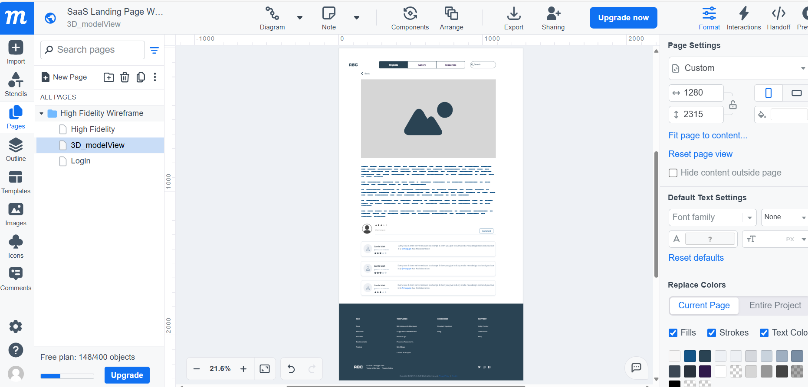
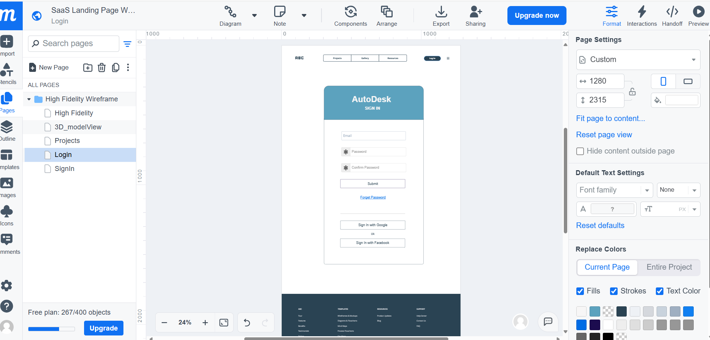
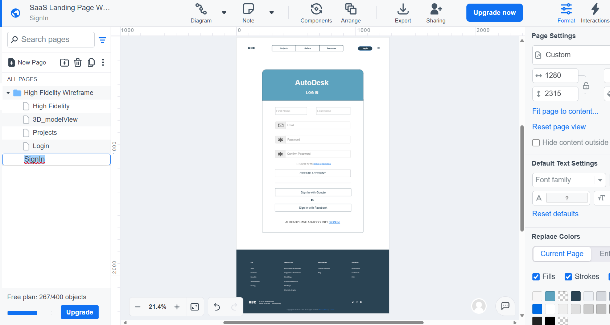
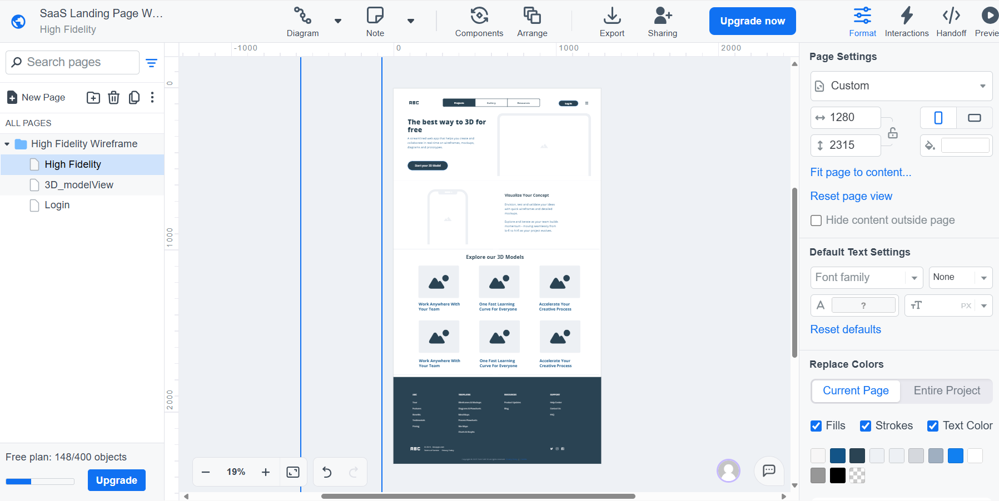
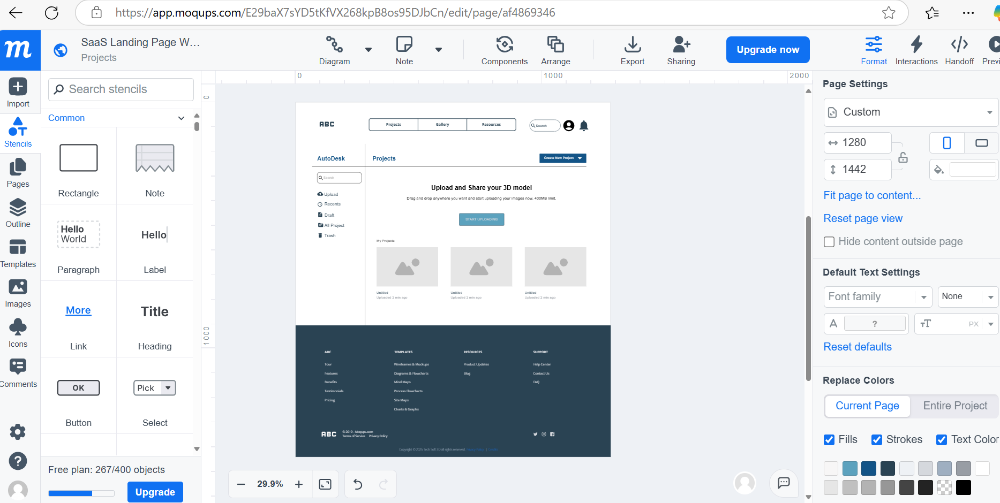
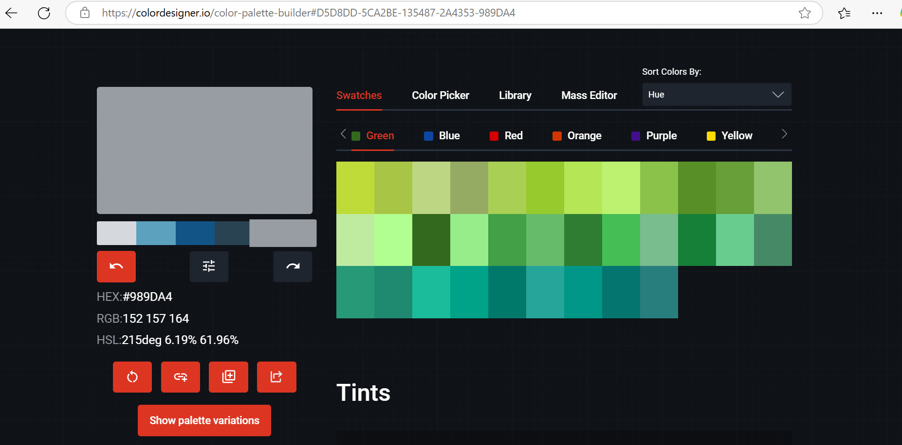

# Week 3
## What I did during this session:
-Helped my friend draw the Use Case Diagram and contributed ideas for user interactions.
-Personally drew fives pages of mockup designs using Moqups to visualize the key pages and features of the website. These pages include the Home Page, Project Page, Model Upload Page, Login Page and Sign-Up Page. After creating these pages, I added my team members to the Moqups project and requested their feedback. Both my friends and I made updates to the designs based on the feedback, improving the user interface and refining key features.
-Selected a color scheme for the website, choosing #D5D8DD (light gray), #5CA2BE(soft blue), #2A4353(teal-gray), #135487 (dark blue), and #989DA4 (gray-blue). I thought that gray suits automotive-related content, while blue is eye-catching and enhances user engagement. My team members agreed on these colors as they align with the overall theme of the project. 
-Referenced popular 3D modeling websites (e.g., Sketchfab, Autodesk Viewer, Thingiverse) for design inspiration and to understand industry standards. 
-Tested the Autodesk API using Postman, focusing on learning its key functionalities for future integration into our platform.

## What I intend to do before the next session:
-Focus on learning the Autodesk API in more depth to integrate its features effectively into the platform.
-Discuss with my team members about the backend structure, particularly how the project page will display all projects related to the user. 
-Work with my team to decide on which programming language and technologies we will use for developing the project. 

## Any issues arising and how I intend to resolve them:
-API Integration: I anticipate challenges with understanding and implementing the Autodesk API due to its complexity.
    -To address this, I asked a friend with experience using APIs for guidance. 
    -Discussed the challenges with my team members to brainstorm solutions and clarify how the APIs can be integrated. 
    -I plan to continuously test small features before fully integrating them into the platform to ensure smooth functionality.
