# Week 4

## What I did during this session:

I focused on understanding how the Model Derivative API works by carefully going through each step. First, I imported the Model Derivative Postman collection file and created an Autodesk account to obtain the client ID and secret, which are essential for authentication. Using Postman, I generated an authentication token to enable secure interaction with the API.

After setting up authentication, I created a storage bucket and obtained a signed URL to upload files to Autodesk's platform. Using this URL, I successfully uploaded a test file and retrieved the update key needed for further processing. Once the file was uploaded, I proceeded to the translation step, where the file was converted into a format compatible with Autodesk’s viewer. Finally, I completed the workflow by successfully downloading the processed file, confirming that each step was executed correctly.

After completing the entire process with Postman, I explored an alternative approach by testing PHP code to retrieve the access token. I used the Guzzle library to make API requests in PHP, which helped streamline HTTP requests and handle responses efficiently. Additionally, I tested 3-legged authentication by modifying the callback URL in Autodesk and attempting to establish a connection. However, we ultimately decided to proceed with 2-legged authentication, as it allowed us to interact with the API without requiring a redirect link. Through this process, I gained a deeper understanding of API interactions, authentication mechanisms, and file processing within the Autodesk platform.

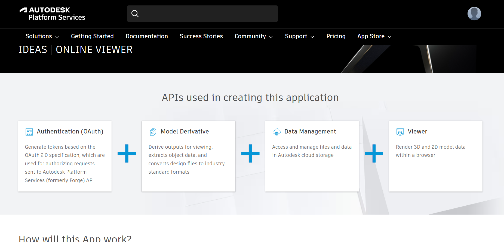
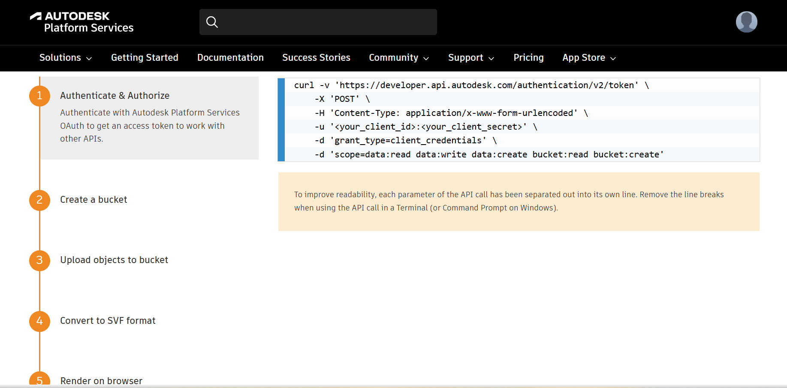
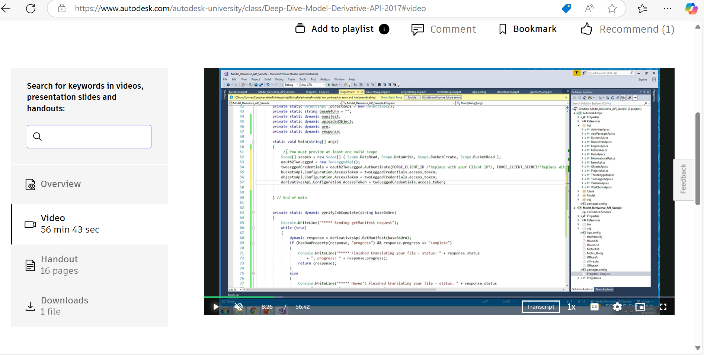
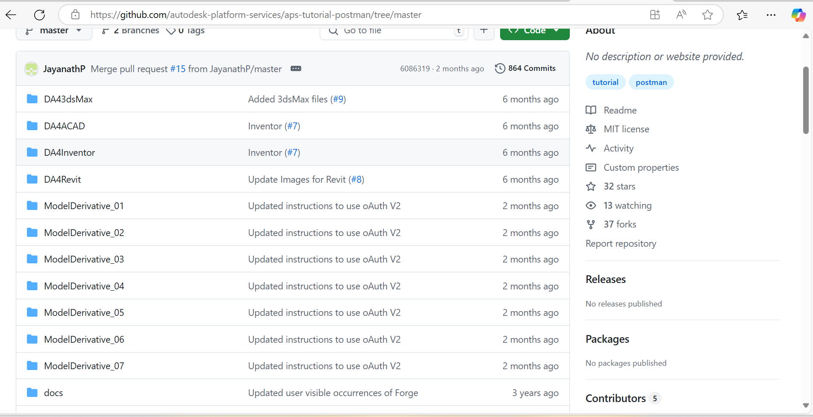
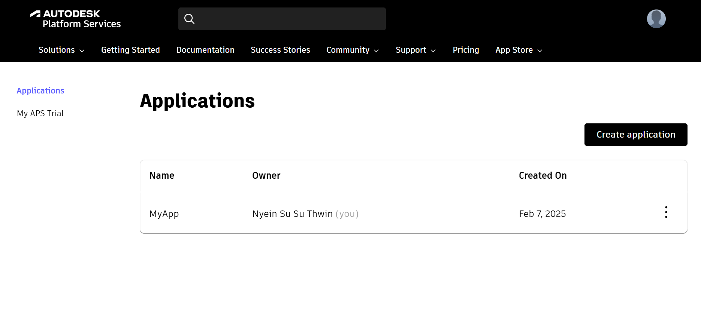
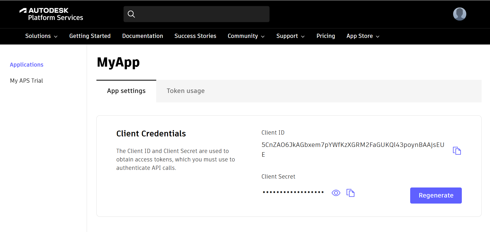
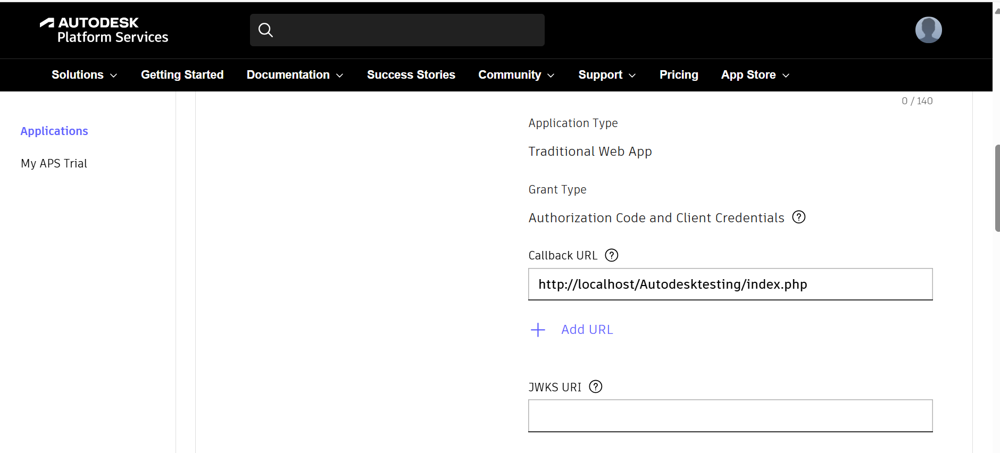

## What I intend to do before the next session:

After testing with Postman, I am now working on writing code to implement the same process, including uploading files, viewing them, and handling the translation step. I have also discussed this with my friend, who is responsible for part of the backend, to coordinate our work effectively.
During the spring week, I plan to start coding and collaborate with my team on backend development. My focus will be on completing the Viewer and Upload functionalities within this period. Additionally, we will discuss the backend structure and finalize the integration of the Model Derivative API into the project.  

## Any issues arising and how I intend to resolve them:

### Understanding API Concepts
Initially, I had no prior knowledge of APIs, so I started by researching their purpose and functionality. I learned how APIs enable communication between different software components and explored API documentation to understand their implementation. By following step-by-step guides, I grasped key concepts such as authentication, endpoints, and request handling.

### Testing with Postman
Setting up and testing API endpoints was challenging at first, as I was unfamiliar with the process. However, by following structured tutorials and API documentation, I gradually learned how to send requests, obtain authentication tokens, and handle API responses efficiently. Postman provided a practical way to visualize API interactions, making the learning process easier.

### API Integration Challenges
Integrating the Model Derivative API required an understanding of authentication, storage, translation, and retrieval, each of which had to be executed in a sequential manner. This process took time, especially when encountering errors, as I had to troubleshoot issues step by step before progressing.

### Debugging and Problem-Solving
Troubleshooting API-related errors took significant time, particularly when dealing with authentication failures, incorrect request parameters, and response handling. Resolving these challenges required a deep dive into API documentation, testing different approaches, and debugging requests to ensure correct implementation. Through this process, I gained valuable experience in diagnosing issues and improving API interactions efficiently.

### 3-Legged Authentication Issue
While testing 3-legged authentication, I encountered an error:
https://developer.api.autodesk.com/authentication/v2/token resulted in a 400 Bad Request response: {"error":"invalid_grant","error_description":"The 'redirect_uri' is invalid."}
This occurred when attempting to authenticate, along with other errors like "no URL found." To resolve this, I reviewed the API documentation, double-checked the callback URL configuration in Autodesk, and ensured it matched the one registered in the developer console. However, after troubleshooting, we decided to proceed with 2-legged authentication, which allowed us to interact with the API without requiring a redirect link.

Step1:
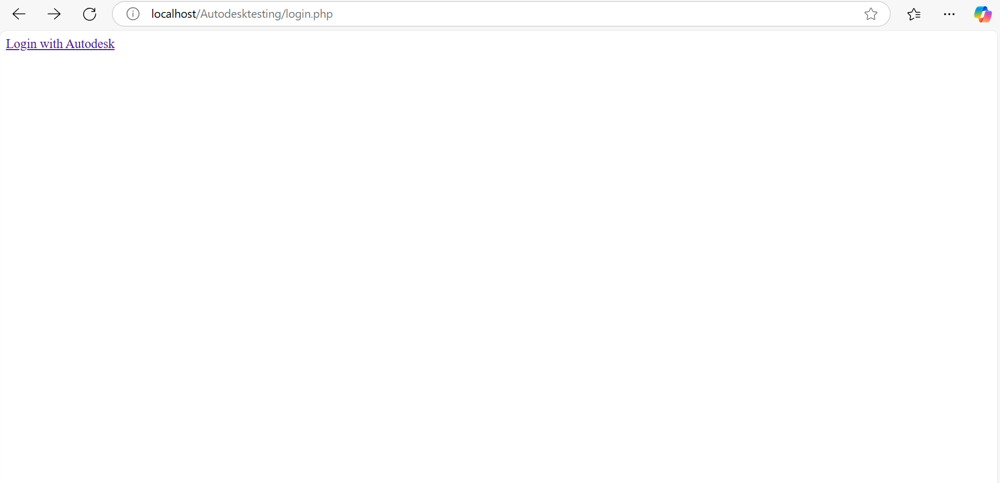
Step2:
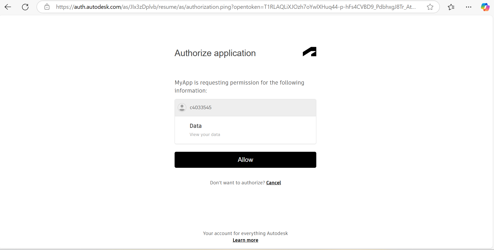
Step3:
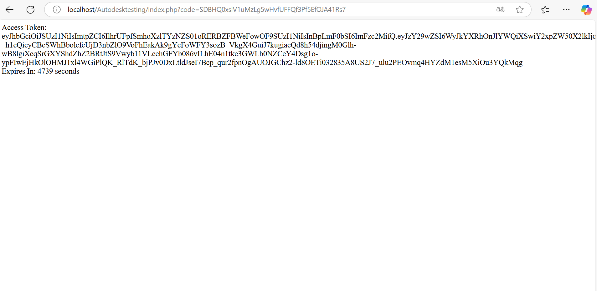

Errors:
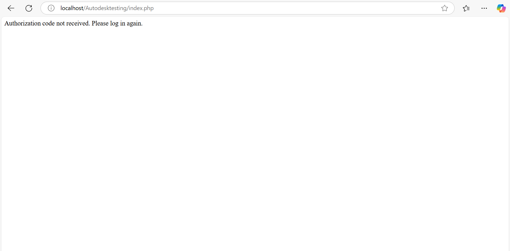
I encountered an authentication error because I attempted to access the index page without first connecting to the login page in Autodesk. This caused the authentication process to fail, preventing access to the API.

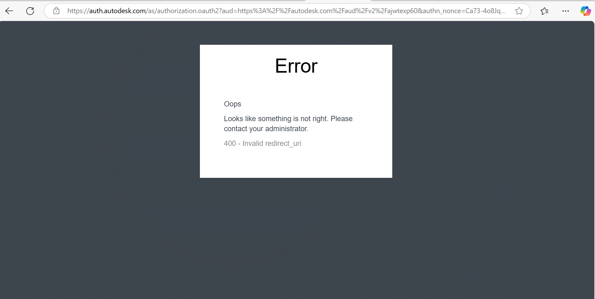
I encountered an error because the callback URL registered in Autodesk did not match my local URL. This mismatch caused authentication to fail, preventing the API from processing the request correctly.

My PHP code:
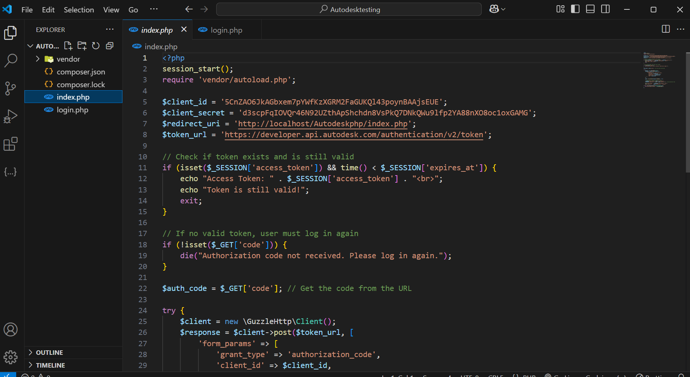
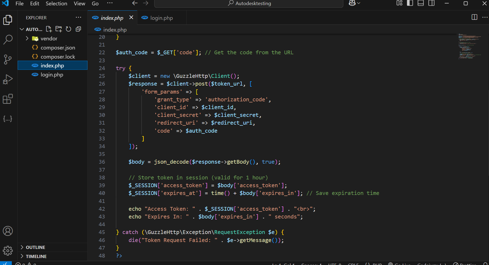