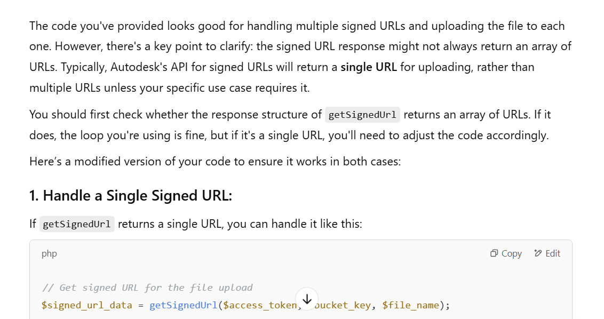

# Week 5 (Spring Week)

## What I Did During This Session

### Day 1
On Day 1, I began implementing the Autodesk Forge API in PHP, focusing on authentication, file uploads, and translation. I first obtained an access token using two-legged authentication with my client ID and secret key. I structured my code with a function to handle token retrieval, which I reused later. After getting the access token, I created a bucket for file storage using another function. I then generated a signed URL for file uploads. During this, I encountered an issue where I mistakenly handled the signed URL (an array) as a string, which led to errors. I resolved this by correctly accessing the URL from the array. I resolved this by correctly accessing the URL from the array and finalized the file upload function. Before these tasks, we discussed what parts to showcase on demo day, deciding to focus on the viewer, upload, and download functionalities. We also drew a rough prototype, deciding to use SVF for the viewer and OBJ format for the upload.

 // output create bucket
 // output upload response 200 
 // get signed url
 
 
 
 
 //output get signedurls

### Day2
On Day 2, I tested the file upload process using the box.obj file from Autodesk's Model Derivative API. After downloading the sample file from Postman, I uploaded it through my code to validate the file handling, authentication, and signed URL generation. I extracted the URN from the object ID and encoded it in Base64 and URL-safe Base64 formats. Aryan had already written the translation code, so 

 

I tried integrating it. However, I encountered the error:

Fatal error: Uncaught TypeError: Cannot access offset of type string on string in C:\xampp\htdocs\Autodeskphp\index.php:430

This happened because the StartTranslationJob() function was returning a string instead of an array. I had assumed $job was an associative array, but it was a raw JSON string. The issue was resolved by properly using json_decode() to decode the string before accessing 'urn'.

Next, I faced another issue:

Status Code 400: Diagnostic Failed

 

This error halted the translation process. At this point, I continued researching and reviewing the API documentation, but the root cause of the issue wasn't clear yet. I would resolve it the following day.

  

 

### Day3

On Day 3, Aryan pointed out that the issue from the previous day might have been due to attempting to translate an OBJ file into another OBJ file, which isn’t a valid transformation in Autodesk’s Model Derivative API. Based on this insight, I changed the output format to SVF.

 

Once I obtained the SVF file, I retrieved the translated URN, which is the unique identifier for the processed file. To integrate the model viewer, I referred to the display_svf2.html file from the Autodesk tutorial and followed the steps to understand the process. I then implemented the necessary code to pass the translated URN to the frontend, embedding it dynamically into a JavaScript variable for model rendering.

I also set up the HTML structure for the viewer, including a 
 element (#forgeViewer) and a hidden dropdown for selecting viewable items. For authentication, I ensured that the access token was securely passed to the frontend, logging it only when successfully retrieved to aid debugging.

Next, I implemented the initializeViewer function to set up the Forge Viewer. This function ensured the viewer container existed before initializing Autodesk Viewer with the required options, and once initialized, it called the loadModel function to load the model.

In the loadModel function, I used the translated URN, formatted as urn:${urn}, and called Autodesk.Viewing.Document.load() to fetch the model. The onDocumentLoadSuccess function checked for valid geometry and loaded the first available model, populating a dropdown menu with viewables. If multiple viewables existed, the dropdown was displayed for user selection. In case of failure, the onDocumentLoadFailure function logged an error message. 

By the end of Day 3, I had successfully set up the Forge Viewer, passed the translated URN to JavaScript, and implemented the logic to load and display the 3D model. However, the URN was not yet being retrieved from a URL link. For Day 4, I planned to combine the frontend page from my team members with my backend page to enable retrieving the URN from the URL link.

### Day4

On Day 4, my focus was on connecting the frontend and backend of the application to ensure smooth interaction for uploading and viewing the 3D model. My main goal was to pass the URN from the backend to the frontend and ensure the correct model was loaded in the Forge Viewer. 

#### 1. Activating the Create Project Button and Connecting to the Upload Process
Before proceeding with the backend redirection logic, I first worked on activating the Create Project button and connecting it to the file upload functionality. Aryan, my team member, had already written the code to handle file uploads and save the uploaded file to local storage. 

Activated the Create Project button so that it triggers the upload process when clicked.
After the file is uploaded, Aryan’s code saves the uploaded file to local storage for later use.
I connected the frontend logic to retrieve the uploaded file from local storage and ensure it's ready for use in the view part.

#### 2. Backend: Redirecting with the URN
Once the file was uploaded and saved in local storage, my task was to redirect the user to the view-asset-model.php page, where the model would be displayed. In the backend, after translating the uploaded model:

I used the header("Location: ...") function to redirect the user to view-asset-model.php.

I attached the URN (translated URN of the uploaded model) as a URL parameter. To ensure safe transmission, I used urlencode() to encode the URN before passing it through the URL. This step ensured that the URN was passed along with the redirection to the view page.

#### 3. Frontend: Extracting the URN from the URL
On the frontend, my next task was to extract the URN from the URL so that I could use it to load the model in the Forge Viewer. In the JavaScript function getURNFromUrl(), I retrieved the URN from the URL using window.location.search and the URLSearchParams object. Logged the extracted URN to the console for debugging purposes, ensuring the parameter was correctly passed from the backend.

#### 4. PHP: Retrieving the URN and Preparing the Viewer
On the view-asset-model.php page, I needed to retrieve the URN parameter from the URL:

I used $_GET['urn'] to check if the URN was present in the URL. If the URN was found, I sanitized it using htmlspecialchars() to prevent XSS (Cross-Site Scripting) vulnerabilities. The sanitized URN was then stored in the $urn variable for use in the Forge Viewer to load the model.

#### 5. Output: 3D Model in Forge Viewer
After implementing the steps for connecting the backend and frontend, I tested the Forge Viewer output:

The model was successfully loaded into the Forge Viewer using the URN passed from the backend. The URN was correctly extracted and passed to the viewer, allowing it to render the 3D model in the application. I confirmed that the viewer displayed the model without issues, and the user could interact with it in 3D.

### Day 5

On Day 5, Aryan and I worked on combining the upload and download functionalities. Aryan had already written the code for the download button, and we integrated it with the upload and viewer features. This ensured that both the upload and download functionalities worked seamlessly, allowing users to easily upload and download files without any issues. During the demo, we showcased our progress, including the file upload functionality, the ability to view 3D models using the Forge Viewer, and the download functionality, as well as our frontend pages. We received valuable feedback from our client, who suggested we consider supporting additional file formats such as documents (docs), PDFs, and videos. This would enhance the versatility of our platform and make it more user-friendly. After the demo, we spent time discussing the next steps for the project. We focused on key aspects such as database storage, including user data, file metadata, and project-related information. Additionally, we explored collaboration features, including defining roles and permissions. One of the main challenges we identified was how to handle multi-user updates, which will be an important issue to address in the coming stages of development.

### Documentation I Learned
- https://aps.autodesk.com/developer/documentation
- https://aps.autodesk.com/en/docs/data/v2/developers_guide/basics/
- https://aps.autodesk.com/en/docs/data/v2/tutorials/upload-file/
- https://aps.autodesk.com/en/docs/oauth/v2/reference/http/authorize-GET/
- https://aps.autodesk.com/developer/overview/viewer-sdk
- https://github.com/Autodesk-Forge/forge-php-client
- https://github.com/autodesk-platform-services/aps-tutorial-postman/tree/master (Postman)
- https://www.php.net/manual/en/class.curlfile.php
- https://www.php.net/manual/en/
- https://www.w3schools.com/php/php_json.asp
- Additionally, I also learned from AI-generated suggestions to improve some parts of my code.

Resources I Used When Encountering Errors
- https://forums.autodesk.com/t5/revit-api-forum/fetch-metadata-of-a-model-using-model-derivative-api-forge/m-p/11246974#M64140
- https://stackoverflow.com/questions/78778136/autodesk-aps-error-deprecated-service-please-contact-aps-helpautodesk-com
- https://stackoverflow.com/questions/895786/how-to-get-the-cookies-from-a-php-curl-into-a-variable
- I also used AI to explore all possible causes and solutions during troubleshooting.

## What I intend to do before the next session:
I plan to focus on learning the Webhook API, particularly how to handle update commit cases, so I can track when a user uploads a new 3D model or makes updates. I'll also dive deeper into the Forge Viewer to understand how to refresh the model when updates occur, ensuring that when a new version of the model is uploaded, it is reflected in the viewer. Once I have a solid understanding, I will discuss my findings with the team to align on how to implement this functionality effectively.

## Any issues arising and how I intend to resolve them:

- While working on the implementation, I encountered several challenges. Initially, I received an "Undefined variable $signed_urls" warning, which led to a "Fatal error: count() on a null value" since the variable was null. I also faced a curl error related to an incorrect file stream type, and the upload failed with a "Recv failure: Connection was reset" message, likely due to network issues or improper request formatting. Additionally, I encountered an error stating that the upload key was missing, which further complicated the file upload process.

- An additional error occurred: "OpenSSL SSL_read: Connection was reset, errno 10054," when Aryan switched from chunked to direct file uploads. This issue stemmed from manually setting the Content-Length header, which caused mismatches. After researching, we dynamically determined the file size using filesize($file_path), set the correct Content-Length header, and used CURLOPT_POSTFIELDS to send the file data. This adjustment significantly reduced connection resets.

- Another problem arose when the translated URN wasn’t being passed to the frontend. After debugging, I found that missing file inclusions in viewer-asset-model.php (such as config.php, functions.php, and upload.php) were causing the issue. Once these includes were added, the URN was successfully passed, allowing the Forge Viewer to load the 3D model.

- Looking ahead, we discussed challenges such as deciding between a single-user or multi-user update system, and whether to integrate Autodesk Forge for real-time collaboration. We determined that integrating Forge might be too complex given our time constraints, so we are considering simpler alternatives for the project. To resolve these issues, I carefully reviewed the API documentation, examined my request and response structures, and consulted Stack Overflow for potential solutions. 