## What I did during this session:

To resolve the issue of uploading large files, I implemented a chunked upload approach. Initially, I faced limitations with PHP’s file size and execution time constraints, which prevented me from uploading files larger than 40MB. To overcome this, I updated the php.ini settings by increasing the upload_max_filesize and post_max_size to 700M, and extended the max_execution_time to 600 seconds to allow for longer upload durations. I also modified the upload process from using a single signed URL to generating multiple signed URLs—one for each chunk. This enabled the file to be split into 10MB chunks, which were uploaded sequentially using the corresponding signed URL for each part. After successfully uploading all chunks, I finalized the process by combining them on the server. I tested this solution with a 637MB (668,901,376 bytes) file, and the upload was completed successfully, confirming that the chunked upload approach was both efficient and reliable for handling large files.

.png)
.png)
.png)
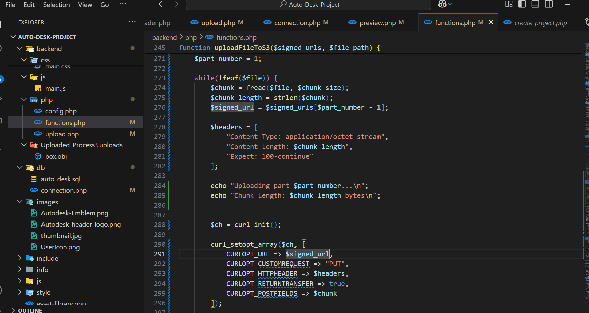
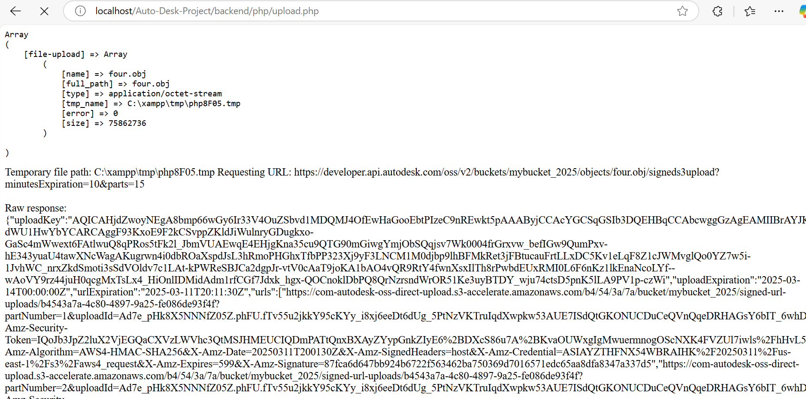
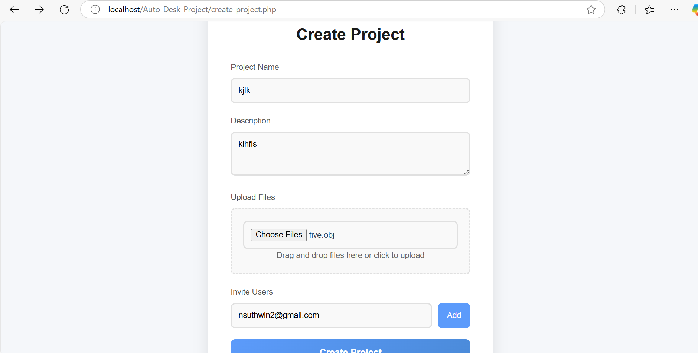
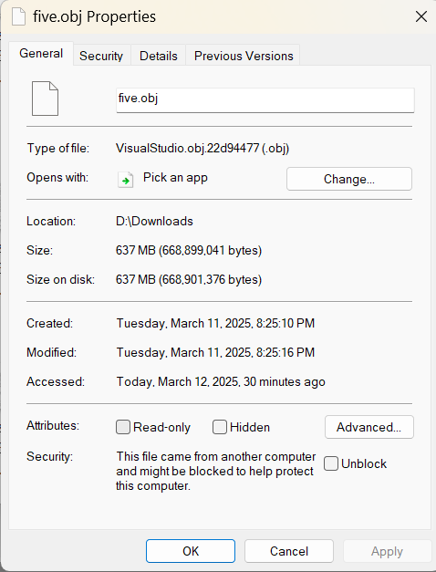
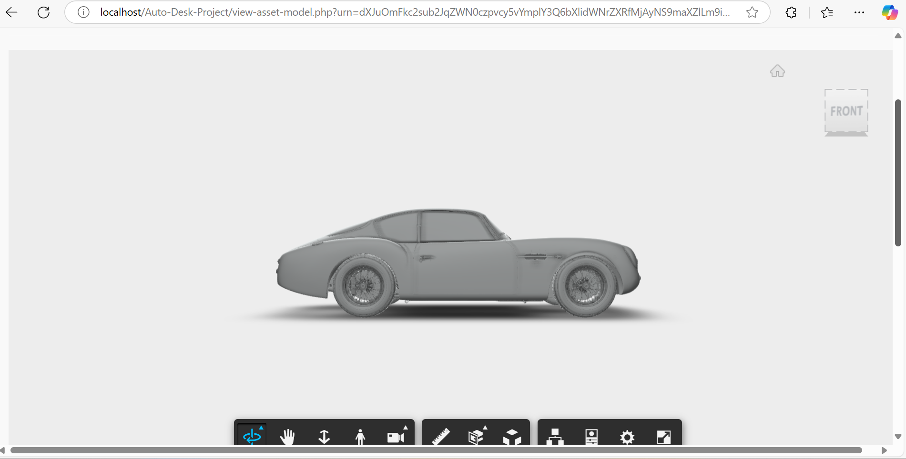
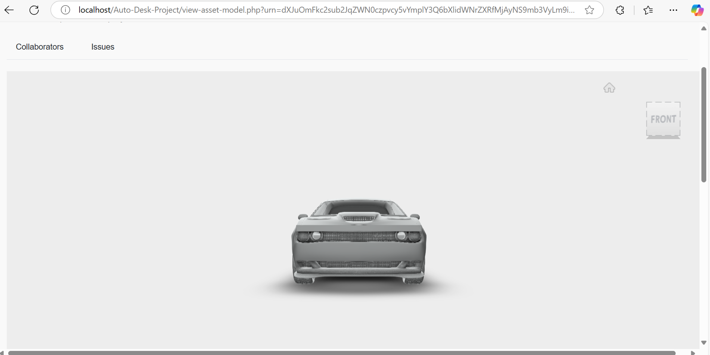

## What I intend to do before the next session:

Before the next session, I plan to implement several changes to improve the current file upload system. First, I will modify the frontend to allow users to select and upload multiple files at once, ensuring that the process can handle multiple uploads simultaneously. I will also update the backend to iterate over an array of files, ensuring that each file is processed correctly without errors. Additionally, I will define and enforce MIME type validation on both the frontend and backend to only accept specific file formats such as .docx, .pdf, images, and videos. I will also implement proper validation to check for file types before processing to mitigate security risks. By completing these tasks, I aim to make the file upload process more flexible, secure, and user-friendly for various file formats and multiple file uploads.

## Any issues arising and how I intend to resolve them:

During the implementation of the chunked file upload system, I encountered several issues that required immediate attention and resolution. The first issue was a file size limit error, which prevented large files from being uploaded. This was caused by the default file size restrictions in PHP, which limit the upload size. To resolve this, I will modify the php.ini settings by increasing the post_max_size and upload_max_filesize values to allow larger files to be uploaded and processed.

.png)
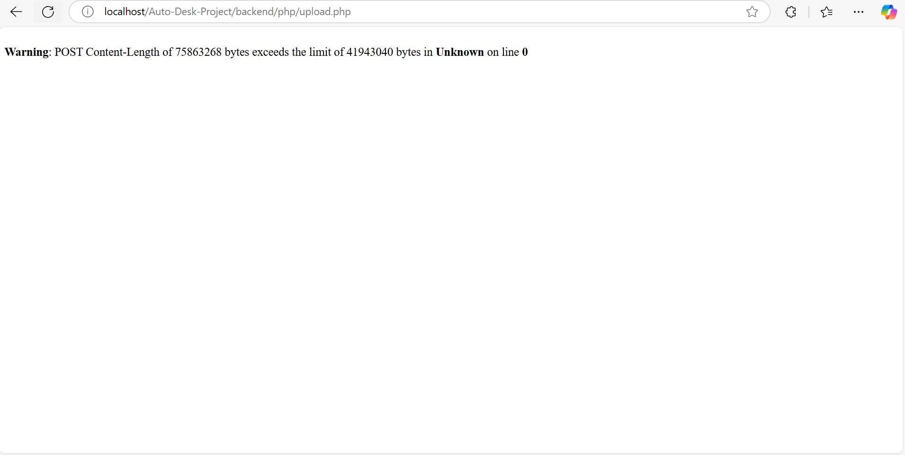
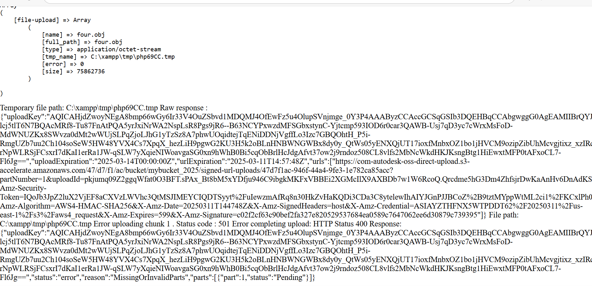

The second issue I faced was a "Call to undefined function getSignedUrls()" error. This error indicated that the getSignedUrls() function was either missing or not properly included in the script. To fix this, I made sure that the functions.php file, which contains the required function, is correctly included in the upload.php script. I also checked whether the function is part of a class and ensured that it is called correctly, in case it requires proper instantiation.

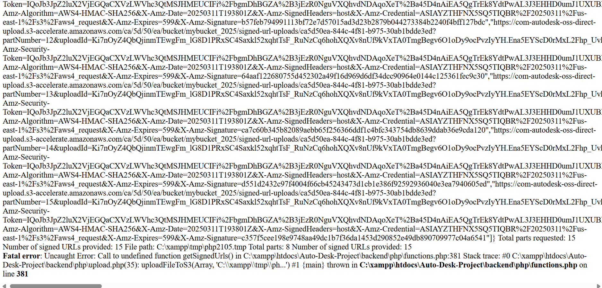
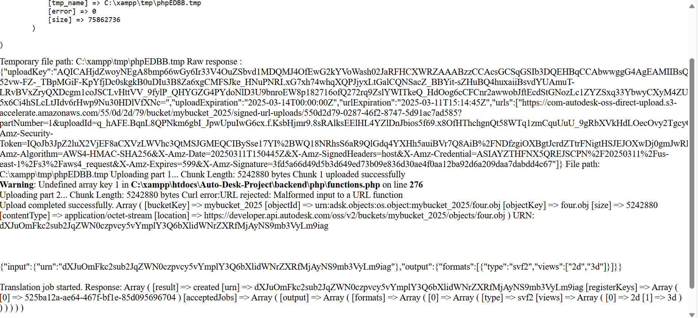

Additionally, I had to address the problem related to Autodesk's API. The previous API URL I was using was not compatible with chunked uploads, and I needed to update it. I revised the Autodesk API URL to support chunked uploads with multiple parts, ensuring that each file chunk has a unique signed URL generated for it. This update will allow the upload process to handle each part of the file individually, improving the overall efficiency of the upload system.
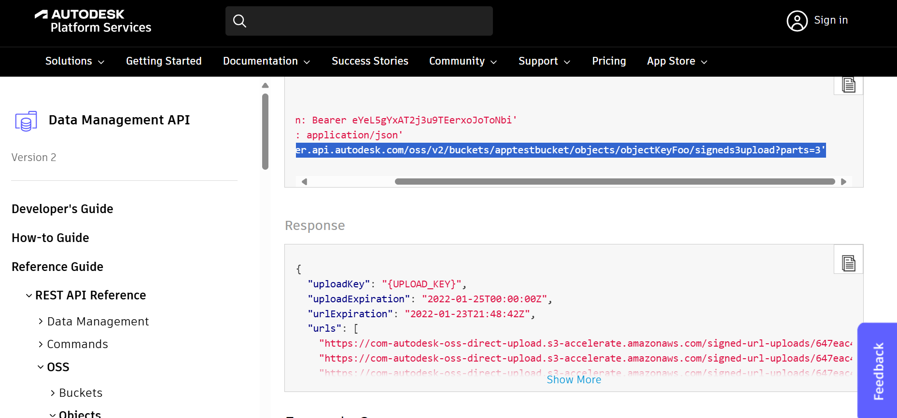

There were also other technical issues during the process, such as missing parameters like an empty file path and a PHP header warning:
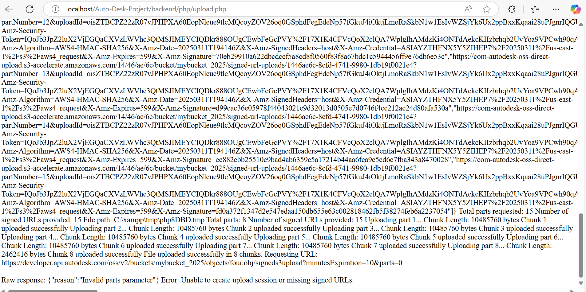
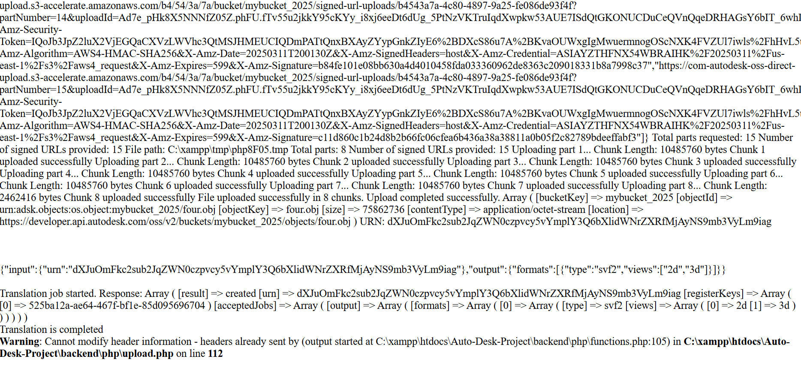
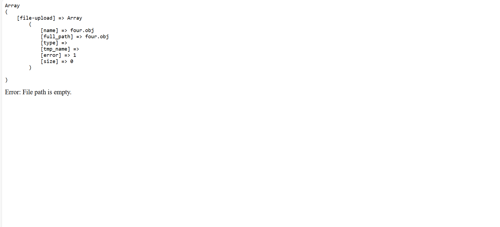

These were carefully debugged and resolved.

By addressing these issues and implementing the necessary changes, I aim to create a more reliable and efficient file upload system that can handle large files and ensure that all file parts are properly uploaded and processed.

