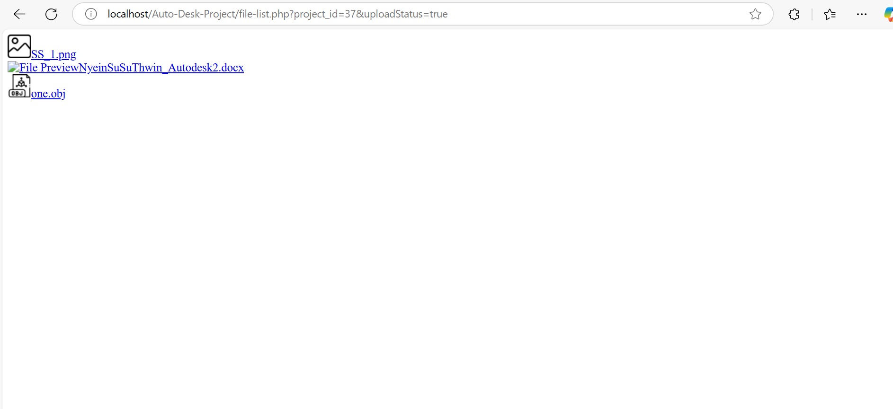
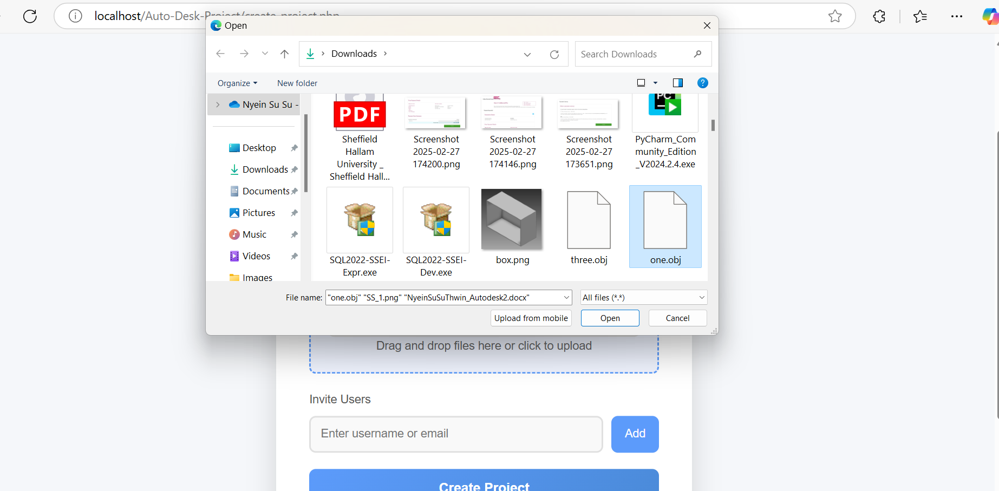
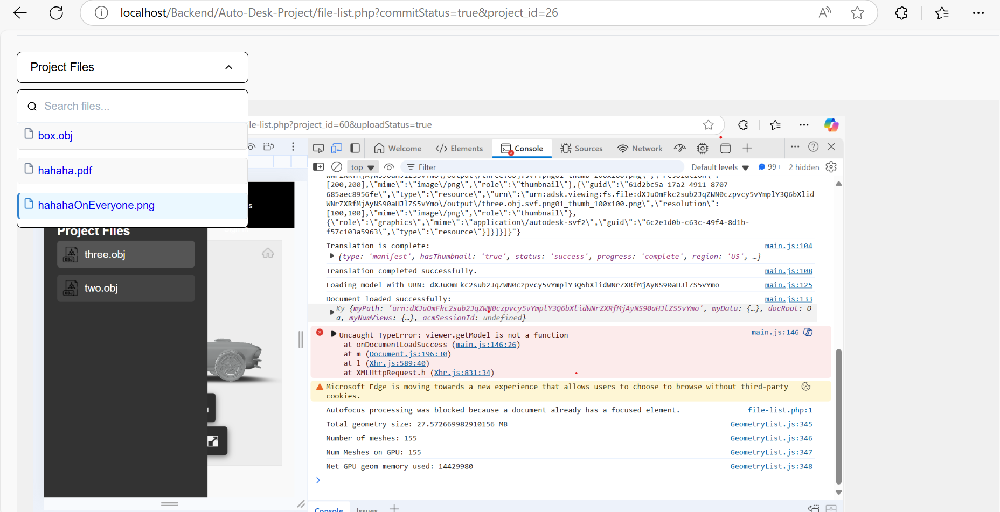

### What I Did During This Session:

During this session, I focused on enhancing the file upload and display functionality by allowing users to upload multiple files and handle different file types efficiently. To achieve this, I used an array to manage the uploaded files and processed each one according to its type. By leveraging the data-file-type attribute, I could determine the format of each file (e.g., OBJ, JPG, PDF) and apply the appropriate actions.

For 3D model files such as OBJ, DWG, and STL, I integrated Autodesk's Forge Viewer to display the models. The models are translated and displayed once they are ready, providing users with an interactive 3D viewing experience. However, I encountered an issue with incorrect URLs when making API calls for translation. I plan to resolve this by adjusting the endpoint path in the startTranslation function to ensure the models are processed correctly.

.png)

For image files (JPG, JPEG, PNG), I developed a system that displays the images directly on the frontend. These images are stored in local storage, and their file paths are saved in the database for future reference. This makes it easy to manage and display images while maintaining a responsive and user-friendly interface.

For document files such as PDFs and DOCX, I initially provided download links for user access. Since the in-browser preview feature wasn’t fully implemented, I used Google Drive links as a temporary solution to allow users to preview these documents. To enable this, I dynamically generated an iframe for PDFs, which is embedded within the webpage for viewing. This iframe element allows the PDF documents to be previewed directly in the browser, providing a seamless experience for users who wish to view document files without downloading them. The file paths for documents are also stored locally, and their paths are saved in the database.

.png)
.png)

This approach enables multiple files to be uploaded, processed, and displayed according to their type. For 3D models, the Forge Viewer will appear, allowing the user to interact with the model. For images, an image container will display the file directly, and for document files, the user will either see a preview (if available) or be provided with a download link. The document preview feature is still under development, but with the use of Google Drive links and iframes, I’ve provided a temporary solution for PDF files.

### What I intend to do before the next session:
I will complete the previous work that is still unfinished, specifically for PDF and DOCX files, by using the appropriate libraries to enable in-browser display. Additionally, I plan to implement support for video file formats, ensuring that videos are properly accepted and displayed on the frontend.

## Any issues arising and how I intend to resolve them:
I encountered an issue with the URL in the startTranslation function, where the server wasn’t receiving the request correctly. After troubleshooting, I found that the endpoint URL needed to be corrected. I plan to fix the URL path and verify that the backend server is functioning correctly.

{"input":{"urn":"dHdvLm9iag"},"output":{"formats":[{"type":"svf2","views":["2d","3d"]}]}}

Autodesk error:
Function: StartTranslationJob
Status code: 400
Response:
string(44) "{"diagnostic":"Invalid 'design' parameter."}"

.png)

