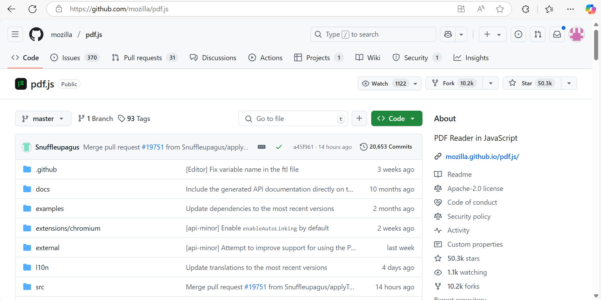
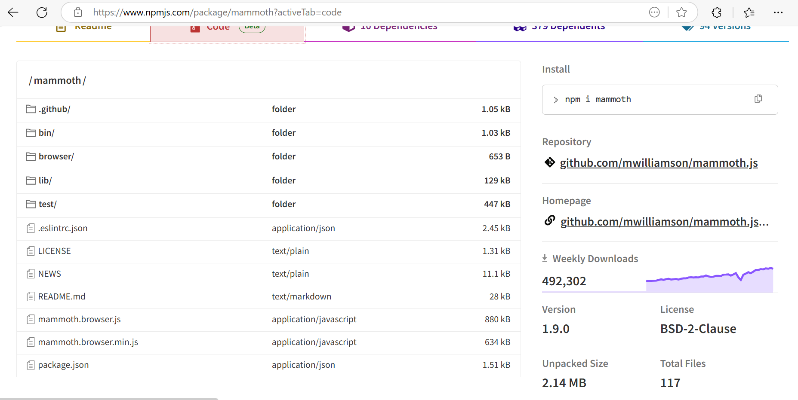

### What I Did During This Session:

During this session, I focused on refining the functionality for handling PDF and DOCX file types using relevant libraries to ensure proper in-browser display.
.png)

PDF File Handling: I successfully integrated pdfjsLib into the frontend of my application to render PDF documents directly in the browser. The PDF file is fetched from the backend using pdfjsLib.getDocument(), and then each page is rendered individually using a <canvas> element, which is appended to the imageContainer. This setup allows the user to view the PDF pages directly in the web page, providing a seamless user experience. More details and resources about pdf.js can be found here: 
https://mozilla.github.io/pdf.js/getting_started/
https://github.com/mozilla/pdf.js

.png)
.png)

DOCX File Handling: I intended to implement the Mammoth.js library to convert DOCX files into HTML for display within the application. However, I encountered an issue with the preview functionality. The issue persists, and I will focus on properly implementing Mammoth for DOCX files to ensure they display correctly. The library’s documentation and further resources can be found at 
https://www.npmjs.com/package/mammoth?activeTab=dependents
https://github.com/mwilliamson/dotnet-mammoth

.png)
.png)
.png)

Support for Video File Formats: In addition to PDF and DOCX files, I plan to implement support for video file formats. This will involve enabling video file uploads, accepting them in the system, and displaying them correctly on the frontend. This will ensure that users can view video content directly on the page without additional steps.

.png)

### What I intend to do before the next session:
Next week, during Spring Week, I will focus on merging the existing code from our team and plan out the tasks to be completed within the week. This includes prioritizing key features, ensuring all parts of the project are integrated smoothly, and setting realistic goals for the week. I'll collaborate with the team to identify what can be finished within the time frame and make sure all code is aligned and ready for final testing and deployment.

## Any issues arising and how I intend to resolve them:

During this session, the main issue encountered was with the rendering of DOCX files using Mammoth.js. When attempting to convert DOCX files to HTML, the preview did not display correctly on the frontend. To resolve this, I will revisit the implementation to ensure that the arrayBuffer is passed correctly to the Mammoth.js library. Additionally, I will verify that the file paths and data formats align with the requirements specified by the library. This will involve checking that the DOCX file is being properly loaded and processed before the conversion. Once these adjustments are made, I will test the implementation again to confirm that the issue is resolved and the DOCX files are correctly rendered in the frontend.

